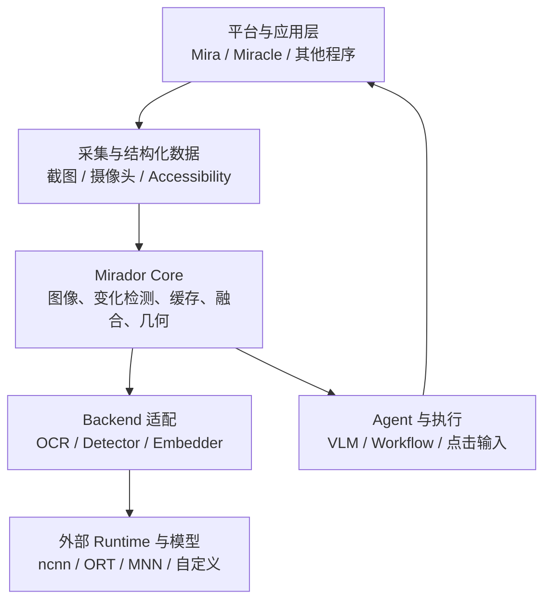
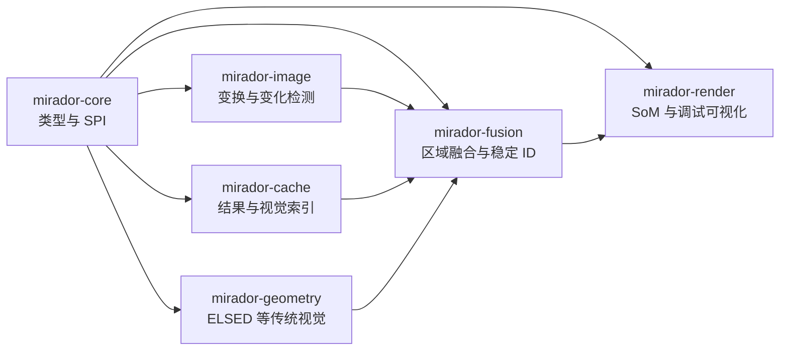
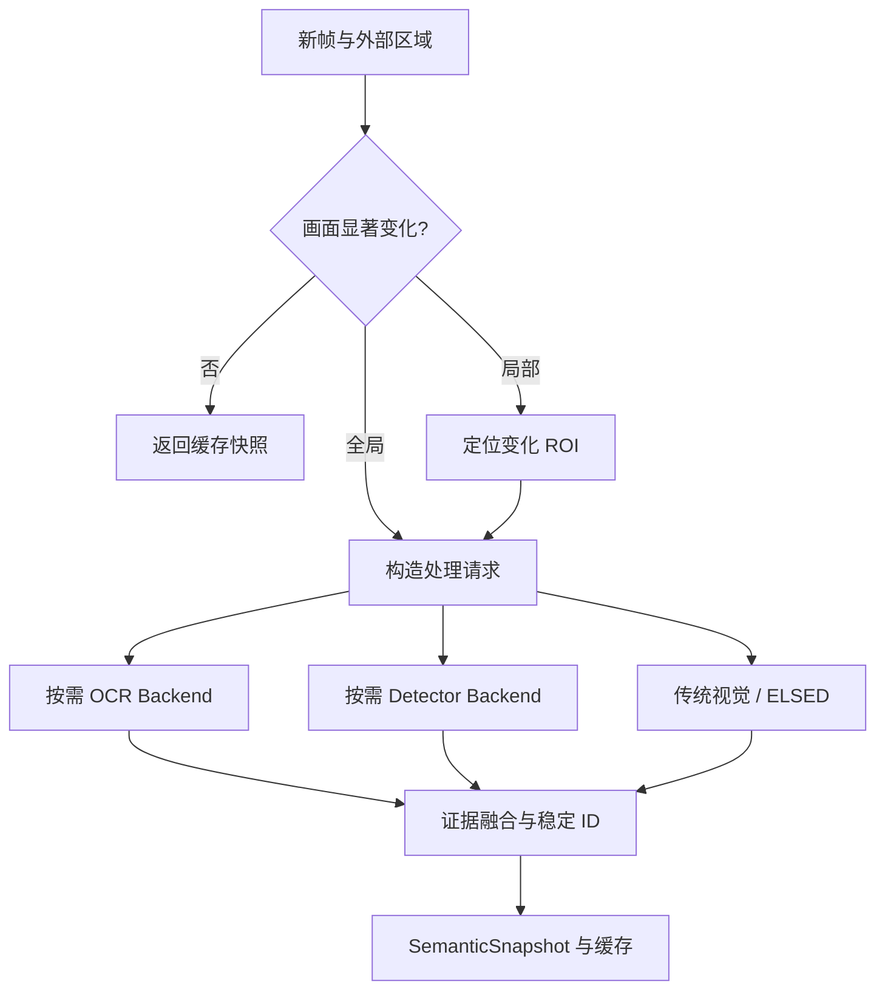
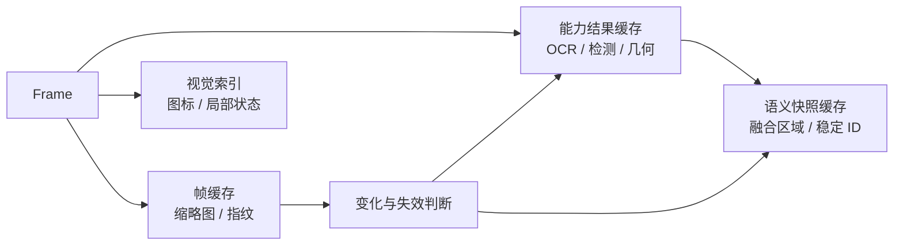

# Mirador 低负载终端视觉基础设施库开发设计方案

## 1. 文档目的

Mirador 是一个面向 Android、Linux 与 Windows 等终端平台的轻量级 C++ 视觉基础设施库。它解决的不是“让 Agent 自己操作界面”的完整问题，而是把终端画面转换为稳定、可查询、可复用的视觉事实：获取图像、判断画面是否变化、定位文字和目标、抽取线段等几何特征、融合多个来源的区域信息，并在画面未显著变化时复用结果。Mira、Miracle 或其他上层系统可以基于这些事实完成 VLM 提示构造、动作选择、点击执行和工作流控制。

本文将 [Mira issue #25](https://github.com/Linductor-alkaid/mira/issues/25) 中面向 Android Agent 的混合视觉定位方案抽离并泛化为 Mirador 的独立设计。原方案中的 Accessibility、OCR、轻量 UI 检测、区域融合、Set-of-Mark、画面变化检测和缓存仍然有价值，但其职责需要重新划界：Mirador 提供平台无关的视觉数据模型、算法管线和扩展接口；平台采集、Accessibility 数据、模型执行器、VLM 和动作执行由调用方或独立适配包提供。

## 2. 背景与需求

移动端和桌面端 Agent 如果完全依赖 VLM 直接预测像素坐标，会受到分辨率缩放、截图压缩、小目标、相似图标和界面变化的影响。只依赖 Accessibility Tree 也不够，因为游戏、Canvas、WebGL、Unity、OpenGL/Vulkan、自绘控件以及部分 Flutter 或 WebView 页面可能缺少可用节点。持续以视频帧率运行 OCR 和检测模型虽然能够提高感知刷新率，却会带来明显的 CPU/GPU/NPU 占用、内存与功耗压力，不适合长期驻留的手机 Agent、桌面宠物和后台自动化工具。

因此，Mirador 需要同时满足四类需求。第一类是低成本的基础视觉处理，例如图像格式转换、缩放、裁剪、哈希、差分、模板或特征匹配和几何检测。第二类是统一外部模型结果，使 OCR、YOLO 类检测器以及未来的小模型能够通过相同接口接入，而不把 ncnn、ONNX Runtime、MNN、TensorRT、Core ML 或 NNAPI 固化为库依赖。第三类是把不同来源的视觉证据转换为稳定的区域与语义快照，使上层不必理解各模型私有张量。第四类是通过事件驱动、分层缓存和按需推理减少重复工作，在画面未发生有效变化时尽可能做到零模型调用。

## 3. 定位、边界与非目标

Mirador 的核心定位是“视觉能力库”，而不是“推理运行时”“Agent 框架”或“并发框架”。核心库本身不加载或执行神经网络模型，不链接 ncnn、ONNX Runtime、TensorRT 等 runtime，不负责下载和管理模型权重，也不规定模型必须来自 PP-OCR、YOLO 或 OmniParser。它只定义稳定的 Backend SPI、输入描述、规范化输出和可选参考后处理。模型 runtime 与权重由上层应用选择并注入，特定 runtime 的实现可以存在于独立仓库、独立包或示例中，但不能成为 `mirador-core` 的传递依赖。

Mirador 不依赖 executor。同步 API 是能力边界的基准，异步执行、线程池、任务优先级、取消、超时和实时调度由调用方控制。为避免妨碍零拷贝与异步 runtime，接口允许调用方传入带生命周期所有权的图像视图和上下文，也允许 Backend 返回同步结果或由可选适配层封装为 future；但核心 API 不暴露 executor 类型。Mira 如果希望使用 executor 调度多个视觉任务，可以在自己的集成层完成，不影响 Mirador 被其他项目单独使用。

Mirador 也不负责 Accessibility 服务、窗口枚举权限、Android MediaProjection 授权、桌面抓屏协议、点击与输入注入、VLM 请求、Agent 决策或 Workflow 状态机。它可以接收调用方提供的结构化区域，例如 Accessibility 节点，并将其与 OCR、检测结果融合；它也可以生成带编号的 Set-of-Mark 图像，但不会决定点击哪个编号，更不会执行点击。



依赖方向必须始终指向 Mirador 的抽象，而不能让核心层反向依赖具体平台、runtime、Mira 或 executor。这样 Mirador 可以被纯 OpenCV 程序、嵌入式视觉程序、Android NDK 应用和桌面 Agent 共同使用。

## 4. 典型问题与对应能力

| 问题 | Mirador 接收的输入 | Mirador 提供的输出 | 对应能力 |
| --- | --- | --- | --- |
| 判断界面是否值得重新感知 | 当前帧、可选上一帧或缓存键 | `ChangeReport` 与变化区域 | 感知哈希、像素差分、局部变化检测 |
| 定位屏幕文字 | 图像与 OCR 请求参数 | 带文字、置信度和坐标的 `TextRegion` | `OcrBackend` SPI、坐标恢复、文本行合并 |
| 定位图标、控件或一般目标 | 图像与类别/阈值参数 | 统一的 `DetectionRegion` | `DetectorBackend` SPI、NMS、坐标恢复 |
| 识别已见过的图标或局部状态 | 查询图块与视觉索引 | 相似候选、距离和来源 | 哈希、模板、局部描述子或嵌入索引 |
| 抽取道路边界、UI 分割线等几何结构 | 图像或 ROI | 线段、角度、长度、支持区域 | ELSED 适配与统一 `LineSegment` 模型 |
| 合并 Accessibility、OCR 与检测结果 | 多源区域集合与坐标空间 | `VisualRegion` 集合与 `SemanticSnapshot` | 去重、关联、来源合并、稳定 ID |
| 给 VLM 提供离散候选 | 图像与区域集合 | 标号图像和 ID 映射 | SoM 渲染，但不包含 VLM 调用 |
| 避免重复高成本推理 | 帧指纹、Backend/模型身份和请求参数 | 命中结果或失效原因 | 分层缓存、显式失效、容量预算 |

## 5. 总体架构

Mirador 建议拆分为小而稳定的核心模块和按需启用的能力模块。`mirador-core` 只包含基础类型、图像视图、坐标系统、区域模型、状态码和 Backend 接口；`mirador-image` 提供缩放、裁剪、颜色转换、差分和哈希；`mirador-cache` 提供有界缓存和视觉索引；`mirador-geometry` 提供线段与轮廓等传统视觉能力；`mirador-fusion` 负责跨来源区域融合与稳定 ID；`mirador-render` 负责调试叠加和 SoM；平台采集和具体 runtime 适配不进入核心发布包。

OpenCV 可以作为部分模块的可选实现依赖，而不是公共 API 类型。公共头文件不暴露 `cv::Mat`，以防止 ABI、版本与构建选项绑定。调用方可以通过适配函数把 `cv::Mat`、Android `AHardwareBuffer`、连续内存或其他图像对象转换为 `ImageView`。第一阶段可以先提供 CPU 连续内存路径，后续再扩展 GPU/native handle，而不破坏现有 API。



## 6. 核心输入模型

图像输入需要明确像素格式、尺寸、步长、方向、坐标空间和生命周期，避免 Android 截图、桌面 BGRA 图像和 OpenCV BGR 图像之间发生隐式错误。基础接口可采用如下形式：

```cpp
namespace mirador {

enum class PixelFormat : uint8_t {
    kGray8,
    kRgb8,
    kBgr8,
    kRgba8,
    kBgra8,
    kNv12,
};

enum class Rotation : uint16_t { k0 = 0, k90 = 90, k180 = 180, k270 = 270 };

struct ImageView {
    const std::byte* data = nullptr;
    int32_t width = 0;
    int32_t height = 0;
    int64_t row_stride_bytes = 0;
    PixelFormat format = PixelFormat::kRgba8;
    Rotation rotation = Rotation::k0;
};

struct Frame {
    ImageView image;
    uint64_t sequence = 0;
    std::chrono::steady_clock::time_point timestamp;
    std::string source_id;
    std::shared_ptr<const void> owner;
};

}  // namespace mirador
```

`ImageView` 是非拥有型视图，`Frame::owner` 用于让共享内存、解码缓冲或平台对象跨调用保持有效。第一阶段所有算法必须支持普通 CPU 内存；对于 NV12 等多平面格式，可以在首个版本中通过扩展的 `ImagePlane` 表示，而不能假定所有图像只有一个连续平面。算法不得静默修改输入。

每个请求还应包含 ROI、最大处理边长、阈值、目标坐标空间和缓存策略。ROI 使上层能够在粗定位后只细化小区域；最大边长用于控制 OCR 或检测前处理成本；缓存策略用于说明是否允许读取、写入或强制刷新。相同帧使用不同 ROI、阈值、Backend 或模型版本时不能误命中同一结果。

## 7. 坐标系统与变换

终端视觉中最容易产生隐蔽错误的是坐标恢复。Mirador 必须将原始帧坐标、裁剪坐标、缩放后模型坐标、旋转坐标和最终显示坐标显式建模。所有区域输出都携带 `CoordinateSpaceId`，所有预处理步骤产生可组合的 `Transform2D`，Backend 输出首先落在其声明的输入空间，再由 Mirador 恢复到调用方要求的空间。

```cpp
struct RectF { float x, y, width, height; };
struct PointF { float x, y; };

struct Transform2D {
    std::array<double, 9> matrix;
    CoordinateSpaceId from;
    CoordinateSpaceId to;
};
```

坐标变换需要覆盖缩放、letterbox、裁剪、旋转和镜像，并提供点、矩形、多边形和线段的统一转换。测试必须验证 0/90/180/270 度方向、非连续 stride、奇数尺寸、不同宽高比和多次往返变换。上层点击安全依赖坐标正确性，因此坐标恢复应被视为核心正确性能力，而不是 Backend 的私有实现细节。

## 8. 统一输出模型

Mirador 应将视觉输出分成“原始能力结果”和“融合语义快照”。原始结果保留 OCR、检测器、几何算法各自有意义的字段，便于独立使用和调试；融合层再把可交互或可描述的区域转换为统一的 `VisualRegion`。这样道路视觉可以只使用线段结果，Mira 则可以继续使用语义区域，而不会被迫经过同一条 Agent 管线。

```cpp
enum class RegionSource : uint32_t {
    kNone          = 0,
    kExternal      = 1u << 0,
    kOcr           = 1u << 1,
    kDetector      = 1u << 2,
    kCache         = 1u << 3,
    kTemplate      = 1u << 4,
};

struct TextRegion {
    RectF bounds;
    std::string utf8_text;
    float confidence = 0.0f;
    std::vector<PointF> polygon;
};

struct DetectionRegion {
    RectF bounds;
    int32_t class_id = -1;
    std::string label;
    float confidence = 0.0f;
};

struct LineSegment {
    PointF begin;
    PointF end;
    float confidence = 0.0f;
};

struct VisualRegion {
    uint64_t stable_id = 0;
    RectF bounds;
    PointF anchor;
    std::string text;
    std::string label;
    std::string description;
    uint32_t source_mask = 0;
    float confidence = 0.0f;
    std::vector<uint64_t> evidence_ids;
};

struct SemanticSnapshot {
    uint64_t frame_sequence = 0;
    uint64_t generation = 0;
    CoordinateSpaceId coordinate_space;
    std::vector<VisualRegion> regions;
    ChangeReport change;
};
```

issue #25 中的 `clickable` 不宜作为 Mirador 内生推断的必选字段，因为“可点击”可能来自 Accessibility 或上层应用语义，而不是图像事实。Mirador 可以在外部区域的属性袋中保留 `interactive`、`role`、`enabled` 等信息，也可以将检测模型给出的 `button` 作为标签，但不能把视觉推测伪装成平台保证。稳定 ID 只保证在一个跟踪会话或缓存代际内尽量稳定，不应承诺跨应用重启或跨设备全局唯一。

## 9. Backend SPI 与无 runtime 设计

Mirador 通过纯 C++ 接口接收已执行完成的 Backend 能力。Backend 负责模型加载、runtime 会话、张量准备和实际推理，Mirador 负责规范化请求、通用前后处理、坐标恢复、缓存与结果组织。接口应支持能力查询和实现身份，以便缓存键、诊断和版本兼容。

```cpp
struct BackendInfo {
    std::string name;
    std::string implementation_version;
    std::string model_id;
    std::string model_revision;
    std::vector<PixelFormat> accepted_formats;
    bool thread_safe;  // M2 冻结:并发能力必须显式声明（同步 API 边界第 3 条）
};

class OcrBackend {
public:
    virtual ~OcrBackend() = default;
    virtual BackendInfo info() const = 0;
    virtual Result<std::vector<TextRegion>> recognize(
        const ImageView& prepared_image,
        const OcrRequest& request,
        const ExecutionContext& context) = 0;
};

class DetectorBackend {
public:
    virtual ~DetectorBackend() = default;
    virtual BackendInfo info() const = 0;
    virtual Result<std::vector<DetectionRegion>> detect(
        const ImageView& prepared_image,
        const DetectionRequest& request,
        const ExecutionContext& context) = 0;
};
```

核心接口优先保持同步，因为同步接口最容易嵌入任意调度环境，也不会把某个 future、协程 ABI 或线程池实现传播给使用者。需要异步的应用可以把调用提交给 executor、`std::jthread`、Kotlin coroutine 或自己的任务系统。Backend 内部也可以使用 runtime 自带异步能力，但必须在同步边界前完成，或者在未来通过单独且不破坏核心 ABI 的异步扩展接口提供。

M2 冻结的契约要点（详见 `DEC-012`）：请求类型同时服务会话层与 SPI 层，字段消费方固定——管线消费 ROI/`max_side`/`output_space`/缓存策略，Backend 消费 `min_confidence`、语言提示与不透明 `backend_params`；Backend 输出一律落在 `prepared_image` 像素空间，坐标恢复由 Mirador 依据预处理链逆变换完成；执行方法以 `const ExecutionContext&` 接收取消与 deadline，实现必须显式报 `kCancelled`/`kTimeout`；相同输入必须产出相同结果，以支撑能力结果缓存语义。Embedder SPI 按 `POST-04` 触发条件延后，复用同一模板。

Mirador 不提供一个看似通用但实际泄漏 runtime 概念的 `Tensor` 公共 API。各模型输入输出差异大，强制统一张量反而会把预处理、量化和设备内存细节推给 Mirador。稳定边界应当是图像和领域结果；具体 Backend 可以在自身实现中自由使用张量。

## 10. 视觉管线与按需执行

推荐的感知流程不是每帧完整执行，而是从廉价判断逐级升级。上层将新帧提交给 `PerceptionSession` 后，Mirador 首先计算快速指纹和低分辨率差分。如果画面与已有快照等价，则直接返回缓存快照。如果只有局部变化，则保留未变化区域的已有证据，并把变化 ROI 交给请求中启用的能力。外部结构化区域足够时，上层可以完全不调用 OCR 或 Detector；不足时由上层策略决定启用哪些 Backend，Mirador 只提供执行组件和可供策略判断的覆盖率、陈旧度与变化报告。



这里需要避免把 issue #25 中的“何时运行 OCR、何时运行检测器”硬编码为 Mirador 的全局策略。对 Mira 来说，Accessibility 优先是合理策略；对道路视觉、游戏状态识别或离线图片分析则未必成立。因此，Mirador 提供默认的 `PerceptionPolicy` 示例和所需指标，但是否调用某个 Backend、任务优先级和超时由上层决定。

## 11. 画面变化检测

变化检测的目标不是判断每个像素是否相同，而是判断已有视觉结果是否仍可使用。第一层使用缩小灰度图的快速哈希或块均值签名，成本应远低于一次 OCR。第二层在签名变化后计算分块差异和连通区域，输出变化面积比例、变化矩形和全局/局部分类。对于动画、光标闪烁、视频区域和时间文本，可通过忽略区域、稳定时间窗和阈值滞回减少无意义失效。

`ChangeReport` 至少应包含帧相似度、变化面积比例、变化 ROI、判断阈值和原因。缓存层根据变化 ROI 与证据区域是否相交决定局部失效，而不是任何细微变化都清空整屏结果。第一阶段可以实现确定性的灰度缩放、块差、dHash/pHash 和形态学合并；后续再评估光流或轻量特征，但不应为了复杂度牺牲基础路径的可预测成本。

## 12. 图像缓存与视觉语义缓存

Mirador 的缓存应分为三层。帧级缓存保存缩略图、指纹和变化检测中间量；能力结果缓存保存某个 Backend 在特定图像、ROI、参数和模型修订上的输出；语义快照缓存保存融合后的区域与稳定 ID。三者使用不同键和容量预算，避免完整截图与小型结构化结果互相挤占。

能力结果缓存键至少包含规范化图像指纹、源 ID、ROI、预处理版本、Backend 名称、实现版本、模型 ID、模型修订和请求参数摘要。模型或后处理升级后必须自然失效，不能只用图片哈希作为键。缓存采用有界 LRU 或按字节预算淘汰，调用方可配置是否保留原始图像；默认不长期缓存完整屏幕，减少内存与隐私风险。

针对“图标识别”的视觉索引应作为独立能力，而不是与推理结果缓存混在一起。它可以按层级使用精确哈希、感知哈希、颜色/边缘描述子、模板匹配，未来再允许注入 Embedder Backend。查询输出是候选列表、距离、阈值和证据类型，而不是直接宣称语义相同。上层只有在距离、尺度和上下文均满足策略时才复用既有标签。



## 13. OCR 能力设计

OCR 在 Mirador 中被拆为文本检测、方向分类和文本识别三个可组合阶段，但第一版可允许单一 `OcrBackend` 一次性返回最终结果。这样 PP-OCR mobile、系统 OCR、云 OCR 或自定义模型都能适配，同时不会强迫所有实现采用 DB 检测加 CTC 识别。Mirador 可提供常用的 resize/normalize、DB 后处理、轮廓框恢复、行合并和文本规范化参考组件，这些组件不负责执行模型。

输入包含图像、ROI、语言提示、最小置信度、最长边、是否需要逐字符信息和输出坐标空间。输出包含 UTF-8 文本、多边形或矩形、置信度以及可选字符级结果。上层若只需要查找某个文字，可以在结果层做匹配，不应要求 OCR Backend 理解 Agent 意图。M2 冻结的 `OcrRequest`（`DEC-012`）不含逐字符开关与字符级结果字段；它们随首个真实需要的 Backend 引入，避免为不存在的消费者固化 schema。

## 14. 目标检测与 UI 区域提议

Detector Backend 面向的不只是 YOLO，也可以适配图标检测器、UI 元素提议器、传统轮廓候选器或分割模型。Mirador 定义统一的类别、边界、置信度和可选掩码，不在核心类型中出现 YOLO anchor、feature map 或 Ultralytics 私有概念。通用模块可提供 letterbox、NMS、类别过滤、坐标恢复和小目标 crop refine 组合器。

对于终端 UI，建议默认以 320 或 416 像素输入产生粗候选，在目标过小或置信度不足时只对候选 ROI 进行高分辨率细化，而不是持续提高整屏输入分辨率。OmniParser `icon_detect_v3`、GPA-GUI-Detector 或其他模型只应作为评测候选和外部 Backend 示例。模型许可证、数据来源和权重再分发义务属于具体适配包及最终产品的发布审查，不应让 Mirador Core 与某个模型绑定。

## 15. ELSED 与传统视觉能力

ELSED 代表 Mirador 与普通“AI 推理封装库”的差异：低负载终端视觉经常可以通过传统几何和图像算法直接解决，不需要启动模型。`LineDetector` 接收灰度图或 ROI，输出统一的 `LineSegmentSet`，并允许实现选择 ELSED、OpenCV LSD 或其他算法。若 ELSED 作为源码依赖引入，应放在可选模块中并审查其许可证，不进入最小核心构建。

围绕线段结果可逐步提供角度过滤、长度过滤、共线合并、图结构聚类、RANSAC 拟合和坐标变换。这些能力既可服务 Mira 的屏幕分隔线和布局理解，也可复用到机器人道路边界等视觉任务。它们保持几何语义，不强行转换为 UI 控件。

## 16. 多源区域融合与稳定 ID

融合层接收外部结构化区域、OCR 文本框、检测框、模板匹配结果和可选几何区域。流程先把所有输入转换到同一坐标空间，再依据 IoU、包含关系、中心距离、文本关系、类别兼容性和来源可信度建立证据关联。重叠的 Accessibility 按钮与 OCR 文本可以融合为一个区域；按钮内部的多个文字行可以作为子证据保留；相邻但语义不同的图标和文本不能仅因距离较近而无条件合并。

融合规则必须确定、可配置并可解释。每个输出区域保存贡献证据 ID 和来源掩码，诊断接口能够说明“哪些证据被合并、使用了哪条规则、置信度如何产生”。置信度第一阶段采用来源权重与几何一致性的显式规则，不尝试伪装成严格概率；待积累标注数据后再考虑校准。

稳定 ID 通过上一快照与当前区域的匹配产生。匹配成本可综合 IoU、中心位移、文字相似度、类别和来源，使用门控后的贪心或二分图匹配。区域内容或位置在合理范围内变化时沿用 ID，发生分裂、合并或大幅变化时分配新 ID并增加快照 generation。SoM 和 Agent 动作必须携带 generation，上层在执行旧动作前可以拒绝已经过期的区域，避免界面变化后的误点。

## 17. SoM 渲染与网格细化

Mirador Render 根据 `SemanticSnapshot` 生成 Set-of-Mark 图像和 `mark_id -> stable_id` 映射。渲染器负责标签放置、遮挡规避、颜色和字体配置、缩放与调试信息，但不构造特定模型的 prompt。Mira 可以把渲染结果发给 VLM，并要求其返回 `{generation, region_id, action}`；Mirador 只负责验证该 ID 是否存在于对应快照以及返回区域锚点。

当区域提议未覆盖目标时，Mirador 可以提供通用的网格划分、裁剪和坐标回映工具。选择哪个网格单元、是否再次询问 VLM、最大细化次数和失败策略属于上层 Agent。这个边界既保留 issue #25 的粗网格回退思路，又不把 VLM 控制流放入视觉库。

## 18. 会话、状态与线程模型

基础算法对象应尽量无状态或具有明确的实例状态。`PerceptionSession` 用于保存某个图像源的上一帧指纹、快照、稳定 ID 跟踪器和缓存命名空间；不同窗口、摄像头或设备使用不同 session。调用方可以创建多个 session 并自行调度，它们之间不共享可变状态，除非显式传入共享缓存。

Mirador 不创建常驻工作线程，不隐藏后台轮询，也不要求全局单例。纯算法函数可并发调用；Backend 是否线程安全由 `BackendInfo` 或能力标记明确声明；同一 session 默认不允许并发修改，但可同时读取已发布的不可变快照。取消和 deadline 可以通过轻量 `ExecutionContext` 传递，其接口仅依赖回调或原子状态，不依赖 executor；M2 起的 SPI 执行方法（`DEC-012`）以 `const ExecutionContext&` 参数接收它，长任务必须周期检查并把取消/超时显式转化为 `kCancelled`/`kTimeout`。`PerceptionSession` 落在 `mirador::fusion` 模块（`DEC-013`），跨帧只保留紧凑变化签名，不保留完整帧。

```cpp
struct ExecutionContext {
    std::function<bool()> is_cancelled;
    std::optional<std::chrono::steady_clock::time_point> deadline;
};
```

为控制二进制体积，公共 API 中可以用抽象接口与 PImpl 隔离实现，但不应为每个像素级操作引入虚调用。C++20 是合适的语言基线，异常策略需要在项目早期确定；面向 Android NDK 的公开边界建议提供 `Result<T>` 与 `Status`，避免强迫使用者启用异常。

## 19. 错误、诊断与可观测性

`Status` 应区分无效输入、不支持的像素格式、坐标变换错误、Backend 不可用、Backend 执行失败、超时、取消、缓存损坏和资源预算超限。错误需要携带稳定错误码与短消息，但不得把某个 runtime 的错误枚举放进公共 API；Backend 可以附加实现私有诊断字符串。

每次管线执行应产生可选的 `PerceptionTrace`，记录各阶段是否执行、缓存是否命中、输入与处理尺寸、耗时、候选数量、融合前后区域数、失效原因和近似内存占用。诊断默认关闭或低成本采样，不能为了观测再次复制整帧。上层据此统计 p50/p95 延迟、模型调用频率、缓存命中率和热路径。

## 20. 性能与资源预算

Mirador 的性能目标应以“避免工作”优先于“加快所有工作”。不变画面的常规路径只执行低分辨率指纹比较并返回不可变快照；局部变化优先只处理变化 ROI；完整 OCR 和检测仅在上层请求时运行。所有缓存必须有字节上限，所有输入尺寸必须有保护，所有细化流程必须有次数与像素预算，防止超大截图、候选爆炸或错误 Backend 结果造成终端资源失控。

首版基准建议覆盖 Android ARM64 中端设备、x86_64 Linux 桌面和 Windows 桌面。指标包括基础库与各模块的静态/动态体积、冷启动时间、变化检测 p50/p95、缓存命中路径延迟、RSS 峰值、每分钟 Backend 调用次数、CPU 利用率和 Android 功耗/温升。OCR 与检测速度单独按 Backend 报告，不能把外部 runtime 的体积与耗时错误归因于 Core，也不能在总指标中隐藏它们。

## 21. 构建、依赖与目录建议

建议使用 CMake 3.16 以上版本并提供按模块开关。最小 `mirador-core` 只依赖 C++20 标准库；OpenCV、ELSED 和渲染字体等均通过选项启用。构建目标名称应稳定，例如 `mirador::core`、`mirador::image`、`mirador::cache`、`mirador::geometry`、`mirador::fusion` 与 `mirador::render`。Android NDK、Linux 和 Windows 在 CI 中分别验证，核心公共头文件使用 GCC、Clang 和 MSVC 编译。

```text
include/mirador/        公共 API
src/core/               基础类型与状态
src/image/              图像转换、哈希与差分
src/cache/              有界缓存和视觉索引
src/geometry/           ELSED 等传统视觉适配
src/fusion/             证据融合与稳定 ID
src/render/             SoM 与调试渲染
adapters/opencv/        OpenCV 类型互操作
examples/               无 runtime 的基础示例
benchmarks/             数据集与性能基准入口
tests/                  单元、属性与集成测试
```

具体 ncnn/ORT Backend 示例如果放在主仓库中，应位于明确的可选 `integrations/` 或独立仓库，并确保默认构建不会获取 runtime 或模型。模型权重不应直接提交到核心仓库，示例通过用户显式提供路径运行。

## 22. 安全、隐私与许可证

终端截图可能包含账号、聊天和支付信息。Mirador 默认只在内存中处理图像，不记录原始帧，不把图像写入磁盘，也不发起网络请求。调试图、缓存持久化和视觉索引持久化必须由调用方显式启用并提供存储位置。日志不得默认输出 OCR 全文或图像内容。

Mirador 自身许可证可以维持 MIT 方向，但每个可选依赖、参考实现和模型适配都要独立记录许可证与来源。runtime 与模型分离并不消除许可证义务：最终发布者仍需审查实际使用的 runtime、权重、训练实现与数据来源。`THIRD_PARTY_NOTICES` 应覆盖随 Mirador 二进制或源码分发的依赖；未随库分发的模型只在适配文档中说明兼容性和审查事项。

## 23. 测试与评测设计

单元测试首先覆盖像素格式、stride、ROI、坐标变换、哈希稳定性、变化 ROI、缓存键、LRU 字节预算、NMS、融合规则和稳定 ID。属性测试应验证任意合法裁剪与缩放变换不会产生越界坐标，往返变换误差在明确容限内。Backend 使用伪实现注入固定结果，以证明 Core 测试不需要下载模型或安装 runtime。

集成评测沿用 issue #25 的代表性 Android 场景，并扩展 Linux/Windows 窗口、机器人图像和离线数据。Android 数据覆盖原生 View、Compose、WebView、Flutter、React Native、Canvas、游戏与中英文文本。评测比较外部结构区域、OCR、Detector、融合、SoM 与图标缓存的增量效果。核心指标包括区域 proposal recall/precision、OCR 文本准确率与 bbox IoU、稳定 ID 延续率、变化检测漏检/误检率、缓存命中率、融合前后目标选择成功率，以及端到端 p50/p95 延迟、RSS、包体积、CPU 和功耗。

测试数据应包含静态页面、局部动画、滚动、弹窗、主题切换、分辨率与旋转变化、小图标以及相似图标。缓存相关测试必须特别验证模型修订、参数、ROI 和预处理版本变化会使旧结果失效，不能只验证正常命中。

## 24. 分阶段开发计划

### M0：边界与骨架

首先建立 C++20/CMake 项目、模块目标、`Status/Result`、`ImageView/Frame`、坐标空间与变换模型，并完成 Linux、Windows、Android NDK 的最小 CI。这个阶段不接入模型，目标是冻结最容易传播到所有模块的公共数据类型和依赖规则，同时通过架构测试确保核心不链接 executor、OpenCV 或任何 runtime。

### M1：基础图像与变化检测

实现 CPU 图像视图、颜色转换、缩放、裁剪、指纹、分块差分、变化 ROI 和帧级有界缓存。提供从 `cv::Mat` 到 `ImageView` 的可选适配，但公共 API 不出现 OpenCV 类型。完成不变画面、局部变化、旋转和动态区域忽略的基准，为“低负载”建立首个可量化闭环。

### M2：Backend SPI 与能力结果缓存

定义 OCR、Detector 和未来 Embedder 的 Backend SPI、能力查询、模型身份、请求与原始结果，并使用 Fake Backend 完成端到端测试。实现能力结果缓存键、显式刷新与失效规则。此阶段可以提供一个外部示例 Backend 验证 ncnn 或 ONNX Runtime 的可适配性，但不能把 runtime 合入 Core。

### M3：传统视觉与视觉索引

加入可选 ELSED/线段检测、几何过滤与统一输出，再实现图块感知哈希、模板匹配和有界视觉索引。通过界面图标状态与道路线段两个差异明显的示例证明 Mirador 不是只服务 Android Agent 的专用封装。

### M4：融合、稳定 ID 与 SoM

实现多源证据关联、确定性融合、来源追踪、置信度规则、跨快照稳定 ID、generation 校验和 SoM 渲染。以 issue #25 的 Android 混合定位场景验证 Accessibility 外部区域、OCR 与 Detector 可以在不侵入 Mira Agent 层的情况下组合。

### M5：平台适配与产品化基准

在独立适配层接入 Android 截图/Accessibility、Linux 窗口采集和 Windows 捕获示例，形成多平台评测集，补齐内存、包体、功耗、线程安全、模糊测试、许可证说明和 API 文档。是否新增 GPU/native buffer 零拷贝路径依据测量结果决定，而不是提前扩大 Core。

## 25. 首版 API 使用示例

以下示例展示调用方拥有调度与 Backend，Mirador 只组织视觉处理。具体命名可在 M0 原型中调整，但依赖关系不应改变。

```cpp
mirador::PerceptionSession session({
    .source_id = "android-main-display",
    .frame_cache_bytes = 4 * 1024 * 1024,
    .result_cache_bytes = 16 * 1024 * 1024,
});

mirador::Frame frame = capture_frame();              // 调用方/platform adapter
auto external_regions = read_accessibility_tree();    // 调用方提供

auto change = session.analyze_change(frame);
if (!change.materially_changed) {
    return session.latest_snapshot();
}

mirador::EvidenceSet evidence;
evidence.add_external(external_regions);

if (needs_text(evidence, change)) {
    evidence.add(session.run_ocr(frame, ocr_backend, ocr_request));
}
if (needs_visual_targets(evidence, change)) {
    evidence.add(session.run_detector(frame, detector_backend, detector_request));
}

auto snapshot = session.fuse(frame, evidence, fusion_options);
auto marked = mirador::render_set_of_mark(frame.image, snapshot, render_options);
return AgentInput{snapshot, marked};                  // VLM/Agent 属于上层
```

这个用法刻意让 `needs_text` 和 `needs_visual_targets` 保留在上层，因为它们依赖任务、设备电量、Accessibility 覆盖率和 Agent 策略。Mirador 可以提供默认辅助函数与统计指标，但不接管决策。

## 26. 验收标准

首个可用版本需要证明：`mirador-core` 在没有 OpenCV、executor 和任何模型 runtime 的环境中能够独立构建；同一套公共 API 能被 Android NDK、Linux 和 Windows 调用；调用方能够注入至少一个 OCR Backend 和一个 Detector Backend；OCR、检测与外部结构区域可以恢复到统一坐标空间并确定性融合；未变化画面不会重新调用 Backend；局部变化可以只失效相交区域或相应能力结果；缓存受明确字节预算约束；稳定 ID 与 generation 能阻止上层使用陈旧区域；ELSED 或等价线段实现可以作为可选模块工作；SoM 输出可以把离散区域交给 Mira，但 Mirador 本身不调用 VLM 或执行动作。

性能验收不应只给出“轻量”描述，而要发布基准环境和数字。至少报告变化检测与缓存命中路径的 p50/p95、完整 OCR/检测路径的外部 Backend 耗时、Core 与各可选模块体积、峰值 RSS、缓存命中率、Backend 调用频率，以及 Android 代表设备上的 CPU 与功耗趋势。准确率方面至少报告变化检测、OCR bbox、区域 proposal、融合增益和最终目标选择成功率。

## 27. 最终设计结论

Mirador 应当是一套小核心、可组合、无 runtime、无调度框架绑定的 C++ 终端视觉基础设施。它向下统一图像与坐标，横向组合传统 CV、OCR、目标检测和视觉缓存，向上提供可解释的视觉证据与语义快照。Mira 使用 Mirador 后，不再需要自己维护图像差分、缓存、坐标恢复和多源区域融合，但仍然保留 Agent、Workflow、VLM、Accessibility 策略和动作执行的控制权。

这一拆分也为 Mirador 自身建立了独立价值：它既能服务手机 Agent 的低负载视觉定位，也能服务桌面自动化、游戏状态判断、机器人传统视觉和其他资源受限终端。项目的首要工程原则不是预装更多模型，而是用统一数据结构、按需执行、结果复用和清晰扩展边界，让调用方以尽可能低的持续成本获得可靠视觉能力。
